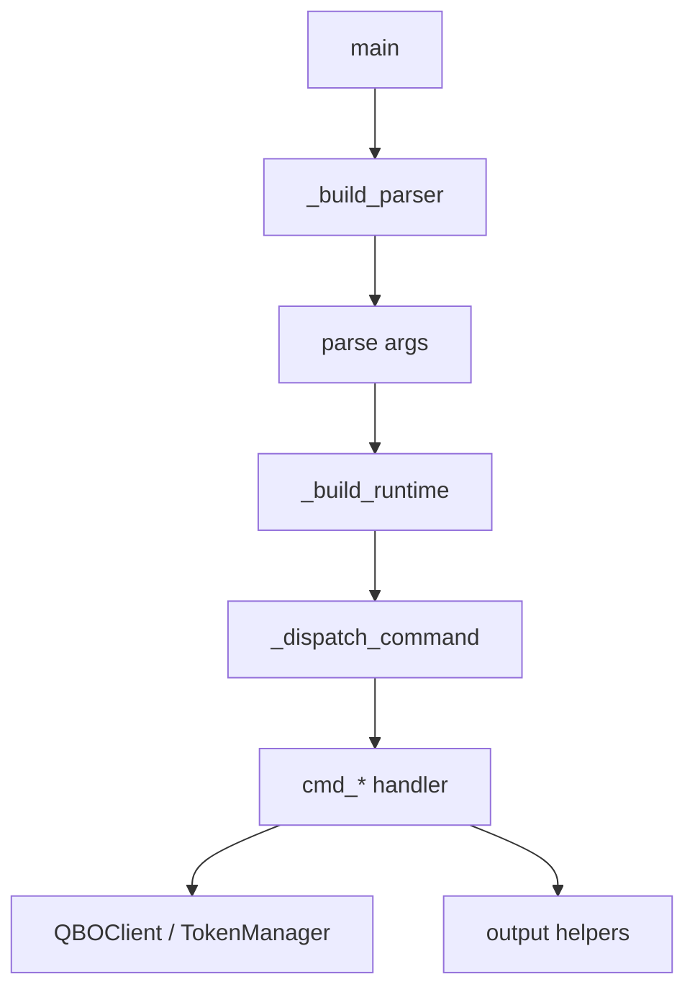

# qbo-cli Architecture

## Overview

`qbo-cli` is a Python command-line interface for QuickBooks Online. As of `v0.9.0`
(post refactor marathon) the package is split into 13 cohesive modules under
`qbo_cli/`. `cli.py` itself is 109 LOC — `main()` + argparse wiring + dispatch
only. Everything else lives in purpose-focused modules.

```text
CLI args
  -> parser construction      (parser.py)
  -> command dispatch         (cli.py)
  -> command handlers         (commands.py, gl_report.py, auth.py)
  -> QBO API layer            (client.py, auth.py)
  -> output formatters        (output.py)
```

## Runtime Flow



## Module Map

| Module               | LOC | Responsibility                                          |
|----------------------|-----|---------------------------------------------------------|
| `cli.py`             | 109 | `main()`, `_build_runtime`, `_dispatch_command`         |
| `parser.py`          | 179 | argparse wiring (`_build_parser`, `_add_output_arg`)    |
| `commands.py`        |  91 | `cmd_query/search/get/create/update/delete/void/report/raw` |
| `auth.py`            | 415 | `TokenManager`, `cmd_auth_*`, OAuth callback server      |
| `client.py`          | 156 | `QBOClient` HTTP layer with refresh + retry             |
| `config.py`          |  83 | `Config` class + profile loading                        |
| `cli_options.py`     |  91 | Shared option helpers: `_resolve_fmt`, `_parse_date`, `_make_client`, stdin helpers, `_build_report_params` |
| `output.py`          | 221 | `output`, `output_text`, `output_tsv`, `_output_entity`, helpers |
| `gl_report.py`       | 727 | GL engine: `GLTransaction`, `GLSection`, parsers, renderers, `cmd_gl_report` |
| `report_registry.py` |  70 | Canonical report names + aliases + `_resolve_report_name` |
| `qbo_query.py`       |  10 | Query string escaping (leaf)                            |
| `constants.py`       |  25 | URLs, paths, MINOR_VERSION, OUTPUT_FORMATS, PROFILE_RE  |
| `errors.py`          |  16 | `die()`, `err_print()` (leaf)                           |
| `py.typed`           |   0 | PEP 561 marker                                          |

## Dependency Graph

```
constants ─┐
errors ────┼─► config ──► auth ──► client ──┐
           │                                ├─► gl_report ─┐
qbo_query ─┤                                │              ├─► cli ─► parser
report_reg ┼─► cli_options ─────────────────┤              │
           │                                ├─► commands ──┘
output ────┴────────────────────────────────┘
```

`cli_options.py` is the cycle-breaker: it holds shared helpers that both
`gl_report.py` and `commands.py` depend on, letting those two sibling modules
avoid importing each other.

`auth.py` does **not** depend on `client.py`. The OAuth token refresh flow
talks to Intuit's token endpoint directly via `requests` instead of routing
through `QBOClient` — that would create an `auth ↔ client` cycle.

## Main Components

### Parser and Dispatch (`cli.py`, `parser.py`)

- `main()` keeps orchestration small: parse args → build runtime → dispatch.
- `_build_parser()` (in `parser.py`) owns CLI shape. Global flags: `--profile`/`-p`, `--sandbox`, `--format`/`-f`.
- `_resolve_profile()` resolves profile from `--profile` > `--sandbox` (alias for `dev`) > `QBO_PROFILE` env > `prod`.
- `_build_runtime()` constructs `Config(profile=...)` and `TokenManager`.
- `_dispatch_command()` owns auth-vs-entity routing and credential validation. Resolves handler names via `cli.py`'s module globals, which is why test code still patches `qbo_cli.cli.cmd_*` for dispatch-level tests even though the handlers themselves live in `commands.py` / `gl_report.py` / `auth.py`.

### Command Glue (`commands.py`, `cli_options.py`)

- Command handlers: `cmd_query, cmd_search, cmd_get, cmd_create, cmd_update, cmd_delete, cmd_void, cmd_report, cmd_raw` all follow the `(args, config, token_mgr)` signature.
- Shared helpers in `cli_options.py`:
  - `_make_client()` — factory for `QBOClient`; patched as `qbo_cli.cli_options.QBOClient` in tests
  - `_resolve_fmt()` — precedence rule: command-specific `--output/--format` overrides global `-f/--format`
  - `_parse_date()` — flexible date input (ISO, DD.MM.YYYY, DD/MM/YYYY)
  - `_read_stdin_json()` / `_read_optional_stdin_json()`
  - `_build_report_params()`
  - `_emit_result()`

### Auth and Tokens (`auth.py`, `config.py`)

- `Config(profile=name)` (`config.py`) loads credentials from env vars > profiled config file section > defaults.
  - Config file (`~/.qbo/config.json`) uses profiled format: `{"prod": {...}, "dev": {...}}`.
  - `Config.tokens_path` returns per-profile token path: `~/.qbo/tokens.{profile}.json`.
  - Legacy flat config (top-level `client_id`) is detected and warned; `auth setup` migrates it.
  - `Config._load()` is split into `_reject_legacy_sandbox_env`, `_load_profile_section`, `_coerce_sandbox` after wave 4.
- `TokenManager` (`auth.py`) owns token persistence, file locking, refresh, and code exchange.
  - Public methods: `load()`, `save()`, `get_valid_token()`, `refresh_if_needed()`, `exchange_code()`.
  - Private refresh pipeline (wave 4 split): `_locked_refresh` → `_fetch_fresh_tokens` → `_post_token_endpoint` + `_die_on_refresh_error` + `_build_token_envelope`.
  - Uses `fcntl.flock` on `~/.qbo/tokens.{profile}.lock` to prevent concurrent refreshes.
- OAuth browser/manual flow: `cmd_auth_init`, `cmd_auth_status`, `cmd_auth_refresh`, `cmd_auth_setup`, `_run_callback_server()`, `_build_auth_url()`, `_read_manual_callback()`, `_build_token_status()`.
- OAuth CSRF `state` parameter is generated via `secrets.token_hex(16)` (wave 6, Cannon).

### API Layer (`client.py`)

- `QBOClient` wraps authenticated HTTP requests.
- `request()` is 12 LOC after wave 4 extraction; it delegates to:
  - `_http_call()` — single HTTP call, converts network failures into `die()`
  - `_send_with_refresh()` — send + on-401 force refresh + retry once
  - `_extract_error_detail()` — human-readable error from failed response; hardened fallback to `resp.text[:500]` on malformed `Fault.Error` (wave 4 fix)
- Public methods: `query` (with auto-pagination), `get`, `create`, `update`, `delete`, `void`, `report`, `raw`.
- Module-level helpers: `_extract_entities` (QueryResponse list extractor), `_PAGINATION_HINT` (precompiled regex).

### Output Layer (`output.py`)

- `output()` dispatches to text/JSON/TSV.
- `output_text()` is split (wave 2) into `_resolve_dict_payload`, `_render_table`, `_select_table_columns`, `_compute_column_widths`, `_render_table_header`, `_render_table_row`, `_print_json_fallback`.
- `_output_entity()` (renamed from `_output_kv` in wave 5) handles single-entity rendering as key-value pairs.
- `_normalize_output_data()` centralizes dict/list normalization shared by text/TSV output.
- Pure formatters live here too: `_pad_line`, `_format_amount`, `_format_date_range`, `_is_month_start`, `_is_month_end`, `_truncate`.

### General Ledger Logic (`gl_report.py`)

- `GLTransaction` and `GLSection` model parsed ledger data.
  - `GLSection.direct_pair()` / `total_pair()` (wave 4) return `(amount, count)` so callers don't need `section.x if section else 0` ladders.
- `_parse_gl_rows()` turns nested QBO report payloads into a tree; uses `_accumulate_direct_txns` and `_absorb_direct_placeholders` helpers (wave 2 extraction).
- Report rendering uses a `_RenderCtx` frozen dataclass (wave 4) bundling `(section_idx, currency, expanded)`, so `_render_node_lines` is 3 params instead of 5.
- `_format_txn_lines()` is a pure list comprehension rather than a mutating accumulator.
- `_build_by_customer_report()` calls `_customer_group_key`, `_group_txns_by_customer`, `_sort_customer_groups` (wave 2 decomposition).
- `cmd_gl_report()` reads as 7 numbered phases after wave 2 Split Phase: client + format → list-accounts short-circuit → resolve inputs → shape tree → validate mode → compute presentation → dispatch render.
- `--list-accounts` supports `text`/`json` only.
- `gl-report` supports `text`/`json`/`txns`/`expanded`; rejects `tsv` explicitly.

### Reports Registry (`report_registry.py`)

- `REPORT_REGISTRY` — canonical QBO report names + descriptions + aliases (e.g. `PnL`/`P&L` → `ProfitAndLoss`).
- `_REPORT_ALIAS_MAP` — precomputed case-insensitive alias lookup.
- `_resolve_report_name()` — maps user input to canonical name; warns to stderr for unknown names and passes through.
- `_format_report_list()` — returns the `qbo report --list` output.

## Safety Boundaries

The best-covered areas (per v0.9.0 coverage baseline):

- `config.py`, `constants.py`, `errors.py`, `parser.py`, `qbo_query.py`, `report_registry.py` — 100%
- `output.py` — 95%
- `client.py` — 89%
- `commands.py` — 80%

The less-covered areas:

- `gl_report.py` — 52% (the GL assembly / subtotal / date-filter paths)
- `auth.py` — 42% (token refresh branches, company switching)
- `cli_options.py` — 69% (some param helpers)

Those areas should get more direct tests before the next large behavioral change.

## Verification Baseline (v0.9.0)

- `uv run pytest -q`: 177 passed, 29 live deselected
- `uv run ruff check .`: clean (E/F/W/I/B)
- `uv run ruff format --check .`: clean
- `uv run mypy qbo_cli` (with `check_untyped_defs = true`): clean (14 source files)
- `uv run qbo --help` / `--version` / `report --list`: all green
- `uv build --wheel`: `dist/qbo_cli-0.9.0-py3-none-any.whl` ships `py.typed`

## Release Mechanics

- Version is defined once in `pyproject.toml`. `qbo_cli/__init__.py` reads it via `importlib.metadata.version("qbo-cli")` for installed packages, or parses `pyproject.toml` via regex for source checkouts.
- `qbo = "qbo_cli.cli:main"` entry point in `pyproject.toml` remains valid.
- `uv build --wheel` + PyPI trusted publishing via GitHub Actions on `gh release create vX.Y.Z`.
