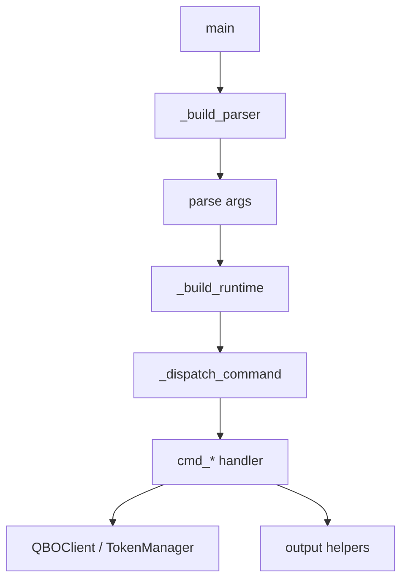

# qbo-cli Architecture

## Overview

`qbo-cli` is a Python command-line interface for QuickBooks Online. The current
implementation still lives primarily in `qbo_cli/cli.py`, but the file is
organized into distinct layers with narrow responsibilities.

```text
CLI args
  -> parser construction
  -> command dispatch
  -> command handlers
  -> QBO client / auth / report helpers
  -> stdout / stderr output
```

## Runtime Flow



## Main Components

### Parser and Dispatch

- `main()` keeps orchestration small.
- `_build_parser()` owns CLI shape.
- `_dispatch_command()` owns auth-vs-entity routing and credential validation.

### Command Glue

- `cmd_query`, `cmd_search`, `cmd_get`, `cmd_create`, `cmd_update`, `cmd_delete`,
  `cmd_report`, `cmd_raw`, `cmd_gl_report`
- Shared helpers:
  - `_make_client()`
  - `_emit_result()`
  - `_read_stdin_json()`
  - `_read_optional_stdin_json()`
  - `_build_report_params()`

### Auth and Tokens

- `Config` loads credentials from env/config file/defaults.
- `TokenManager` owns token persistence, file locking, refresh, and code exchange.
- OAuth browser/manual flow is handled by `cmd_auth_*` helpers and `_run_callback_server()`.

### API Layer

- `QBOClient` wraps authenticated HTTP requests.
- Handles:
  - authorization headers
  - base URL selection
  - token refresh retry on `401`
  - pagination for QBO query endpoints
  - CRUD/report/raw request helpers

### Output Layer

- `output()` dispatches to text/JSON/TSV modes.
- `_normalize_output_data()` centralizes dict/list normalization shared by text/TSV output.
- `_output_kv()` handles readable single-entity rendering.

### General Ledger Logic

- `GLTransaction` and `GLSection` model parsed ledger data.
- `_parse_gl_rows()` turns nested QBO report payloads into a tree.
- Report builders format that tree into text, JSON-like structures, or transaction lists.
- `cmd_gl_report()` remains the orchestration point for account discovery, customer resolution,
  date handling, and final rendering.

## Safety Boundaries

The safest refactor areas are parser/dispatch, output formatting, and shared
command glue because they are already covered by unit tests. The riskier areas
are:

- OAuth callback handling
- token persistence/refresh internals
- `cmd_gl_report()` orchestration branches

Those areas should get more direct tests before large extraction into new
modules.

## Verification Baseline

- `pytest`: `124 passed, 10 deselected`
- `ruff check qbo_cli/cli.py`: passing
- `mypy qbo_cli`: passing
